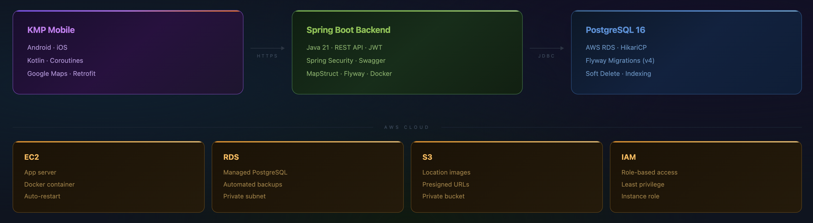
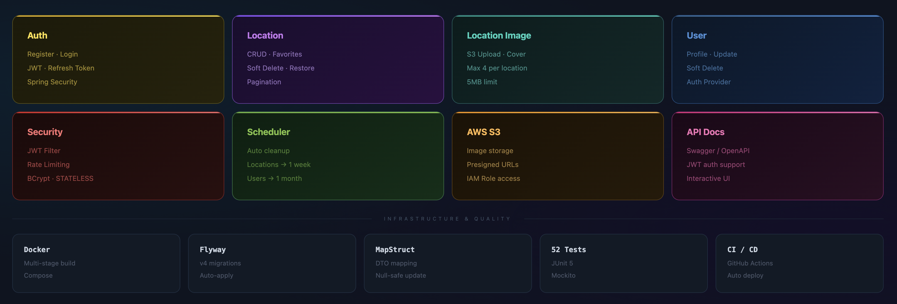

# RotaMe Backend

> A location tracking mobile application backend — save, organize, and revisit your favorite places with image support and Google Maps integration.

---

## Overview

RotaMe is a production-ready REST API backend for a cross-platform mobile application built with Kotlin Multiplatform (Android + iOS). Built with **Spring Boot 4**, **Java 21**, and **PostgreSQL**, the backend follows a feature-based architecture with clean separation of concerns across every layer. The system is fully containerized with Docker and designed for deployment on AWS.

The KMP mobile client communicates with the backend over HTTPS for all REST operations. Users can register, save locations on a map, upload images for each location, mark favorites, and manage their profile.

---

## System Architecture

The following diagram illustrates the high-level system flow — from the KMP mobile client through the Spring Boot backend to PostgreSQL, and the supporting AWS cloud services.



The mobile client sends requests over HTTPS for all API operations. The Spring Boot backend handles authentication, business logic, and data persistence via JDBC to a PostgreSQL database hosted on AWS RDS. Location images are stored on AWS S3 with presigned URL access. IAM roles handle secure access between services with least-privilege principles.

---

## Feature Modules

The backend is organized into independent feature modules, each owning its own entity, repository, service, mapper, DTO, and controller layers.



| Module | Description |
|---|---|
| **Auth** | Registration, login, JWT access + refresh token, logout |
| **Location** | Create, read, update, soft delete, restore, favorite toggle with pagination |
| **Location Image** | S3 image upload, cover photo selection, max 4 images per location |
| **User** | Profile management, update, soft delete |
| **Security** | JWT filter, IP-based rate limiting, BCrypt password hashing |
| **Scheduler** | Auto hard-delete of soft-deleted locations (1 week) and users (1 month) |

---

## Tech Stack

| Category | Technology |
|---|---|
| **Language** | Java 21 |
| **Framework** | Spring Boot 4.0.5 |
| **Security** | Spring Security 7, JWT (jjwt 0.12.6) |
| **Database** | PostgreSQL 16, Spring Data JPA, Hibernate 7 |
| **Connection Pool** | HikariCP |
| **Migrations** | Flyway 11 |
| **Mapping** | MapStruct 1.6.3 |
| **Documentation** | Swagger / OpenAPI 3 (springdoc) |
| **Containerization** | Docker (multi-stage build), Docker Compose |
| **Cloud** | AWS EC2, RDS, S3, IAM |
| **Testing** | JUnit 5, Mockito |
| **Build** | Maven |

---

## Project Structure

```
src/main/java/com/altankoc/rotame/
├── auth/               # Registration, login, refresh token, logout
│   ├── controller/
│   ├── dto/
│   └── service/
├── location/           # Location CRUD, favorites, images
│   ├── controller/
│   ├── dto/
│   ├── entity/
│   ├── mapper/
│   ├── repository/
│   └── service/
├── user/               # Profile management
│   ├── controller/
│   ├── dto/
│   ├── entity/
│   ├── mapper/
│   ├── repository/
│   └── service/
└── core/
    ├── base/           # BaseEntity (id, createdAt, updatedAt, deleted)
    ├── config/         # JwtProperties, AwsProperties, S3Config, OpenApiConfig
    ├── exception/      # GlobalExceptionHandler, custom exceptions
    ├── ratelimit/      # IP-based rate limiting filter
    ├── response/       # ErrorResponse
    ├── s3/             # S3Service, presigned URL generation
    ├── scheduler/      # Auto cleanup scheduler
    └── security/       # JwtService, JwtAuthFilter, CustomUserDetails
```

---

## API Endpoints

### Auth
| Method | Endpoint | Description |
|---|---|---|
| `POST` | `/api/v1/auth/register` | Register a new user |
| `POST` | `/api/v1/auth/login` | Login with email or username |
| `POST` | `/api/v1/auth/refresh` | Refresh access token |
| `POST` | `/api/v1/auth/logout` | Logout and invalidate refresh token |

### Locations
| Method | Endpoint | Description |
|---|---|---|
| `POST` | `/api/v1/locations` | Create a new location |
| `GET` | `/api/v1/locations` | Get all locations (paginated) |
| `GET` | `/api/v1/locations?onlyFavorites=true` | Get favorite locations |
| `GET` | `/api/v1/locations/{id}` | Get location by ID |
| `PUT` | `/api/v1/locations/{id}` | Update location |
| `DELETE` | `/api/v1/locations/{id}` | Soft delete location |
| `PATCH` | `/api/v1/locations/{id}/restore` | Restore soft-deleted location |
| `PATCH` | `/api/v1/locations/{id}/favorite` | Toggle favorite |

### Location Images
| Method | Endpoint | Description |
|---|---|---|
| `POST` | `/api/v1/locations/{id}/images` | Upload image (multipart, max 5MB) |
| `GET` | `/api/v1/locations/{id}/images` | Get all images for a location |
| `DELETE` | `/api/v1/locations/{id}/images/{imageId}` | Delete image |
| `PATCH` | `/api/v1/locations/{id}/images/{imageId}/cover` | Set cover image |

### User
| Method | Endpoint | Description |
|---|---|---|
| `GET` | `/api/v1/users/me` | Get current user profile |
| `PATCH` | `/api/v1/users/me` | Update profile |
| `DELETE` | `/api/v1/users/me` | Soft delete account |

---

## Database Schema

The database is managed by Flyway with versioned migration scripts:

- **V1** — Core table: `users`
- **V2** — `locations`
- **V3** — `location_images`
- **V4** — `refresh_token` column added to `users`

Key design decisions:
- **Soft delete** on users and locations with scheduled hard-delete cleanup
- **Indexes** on frequently queried columns (`email`, `username`, `user_id`, `latitude/longitude`)
- **Unique constraints** on email and username
- **Foreign key constraints** with cascade on related records

---

## Security

- **JWT Authentication** — stateless, access token (1 hour) + refresh token (7 days) with token rotation
- **Spring Security** — all endpoints protected except `/api/v1/auth/**`, `/actuator/**`, and Swagger UI
- **Rate Limiting** — IP-based limiter on login and register endpoints (5 requests/minute)
- **Soft Delete Guard** — deleted accounts are blocked at the `UserDetails` level
- **BCrypt** — passwords are hashed with BCrypt before storage

---

## Running Locally

### Prerequisites
- Java 21
- Docker & Docker Compose

### With Docker Compose

```bash
# Clone the repository
git clone https://github.com/altankocdev/rotame-backend.git
cd rotame-backend

# Start the application
docker compose up --build
```

The API will be available at `http://localhost:8080`.

### Without Docker

```bash
# Requires a running PostgreSQL instance
./mvnw spring-boot:run -Dspring-boot.run.profiles=dev
```

### Environment Variables (Production)

| Variable | Description |
|---|---|
| `DB_URL` | PostgreSQL JDBC URL |
| `DB_USERNAME` | Database username |
| `DB_PASSWORD` | Database password |
| `JWT_SECRET` | JWT signing secret (min 256 bits) |
| `AWS_ACCESS_KEY` | AWS IAM access key |
| `AWS_SECRET_KEY` | AWS IAM secret key |
| `AWS_S3_BUCKET_NAME` | S3 bucket name for image storage |

---

## Testing

The project includes **52 unit tests** covering all service layers:

```bash
./mvnw test
```

| Test Class | Coverage |
|---|---|
| `AuthServiceImplTest` | Register, login, refresh, logout |
| `LocationServiceImplTest` | CRUD, soft delete, restore, favorite toggle |
| `LocationImageServiceImplTest` | Upload, delete, cover, validations |
| `UserServiceImplTest` | Profile get, update, delete |

---

## API Documentation

Interactive Swagger UI is available at:

```
http://localhost:8080/swagger-ui/index.html
```

---

## Deployment

The application is designed for AWS deployment:

1. **EC2** — Run the Docker container
2. **RDS** — Managed PostgreSQL database
3. **S3** — Location images with presigned URL access
4. **IAM** — Instance role for secure S3 access (no hardcoded credentials)

Production configuration is handled via environment variables — no secrets in source code.

---

## Related

- **Mobile Client** → [rotame-mobile-app](https://github.com/altankocdev/rotame-mobile-app)

---

## 📄 License
This project is licensed under the MIT License - see the [LICENSE](LICENSE) file for details.

## 👨‍💻 Developer
**Altan Koç**
* GitHub: [@altankocdev](https://github.com/altankocdev)

---
⭐ **If you found this project helpful, please give it a star!** ⭐

---
*Built with ❤️ using Java and Spring Boot*